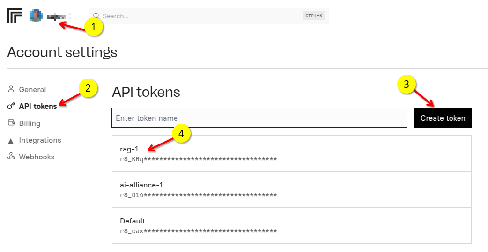

# 1 - Getting Started

This guide will cover how to get the code and setup your local python dev environment.

Please complete these steps:

- [1 - Download the code](#step-1-download-the-code)
- [2 - Setting up Python Dev Environment](#step-2-setting-up-python-dev-environment)
- [3 - Sign up for Replicate](#step-3-sign-up-for-replicate)


## Step-1: Download the code

The code for RAG is [here](https://github.com/IBM/data-prep-kit/tree/dev/examples/notebooks/rag-pdf)

Start by cloning the repository

```bash
git    clone    https://github.com/IBM/data-prep-kit
```

The code for this tutorial is in this directory: `examples/notebooks/rag-pdf-1` .

All files referred in this tutorial are in this folder.

Go to the project directory

`cd   data-prep-kit/examples/notebooks/rag-pdf-1`


## Step-2: Setting up Python Dev Environment

We can use 

- Option-A: Use Anaconda environment
- Option-B: Use python virtual env

Just follow one.  (A) is recommended!

### 2A (Recommended): Anaconda Python environment

You can install Anaconda by following the [guide here](https://www.anaconda.com/download/).

You can also use [mini conda](https://github.com/conda-forge/miniforge)

We will create an environment for this workshop with all the required libraries installed.

#### 2A.1: Setup a conda env

```bash
conda create -n data-prep-kit-rag -y python=3.11
```

activate the new conda environment

```bash
conda activate data-prep-kit-rag
```

Make sure env is swithced to **data-prep-kit-rag**

Check python version

```bash
python --version
```

should say : 3.11

**Note**: If you are on a linux system install these too

```bash
conda install gcc_linux-64

conda install gxx_linux-64
```

#### 2A.2: Install dependencies


Install requirements.txt from project directory: `examples/notebooks/rag-pdf`

```bash
pip  install  -r requirements.txt
```

#### 2A.3: Start Jupyter

`jupyter lab`

This will usually open a browser window/tab.  We will use this to run the notebooks


### Option 2B: Python virtual env

#### 2B.1: Have python version 3.11

```bash
## Check python version
python --version
# should say : 3.11
```

#### 2B.2: Create a venv

```bash
cd examples/notebooks/rag-pdf


python -m venv venv

## activate venv
source ./venv/bin/activate

## Install requirements
pip install -r requirements.txt
```


#### 2B.3: Launch Jupyter

`./venv/bin/jupyter lab`

This will usually open a browser window/tab.  We will use this to run the notebooks

**Note:**: Make sure to run `./venv/bin/jupyter lab`, so it can load installed dependencies correctly.

## Step-3: Sign up for Replicate

Get a **free** account at [replicate](https://replicate.com/home)

💰 Use this [invite](https://replicate.com/invites/a8717bfe-2f3d-4a52-88ed-1356231cdf03) to add some credit to your Replicate account!

The free account will give you a few API calls for free.  That is enough for this tutorial.

Once you sign up, **create a token** by following these steps.

- Go to **Account**
- And select **API tokens**
- Create a new token, called **rag-1** (you can use any name)


