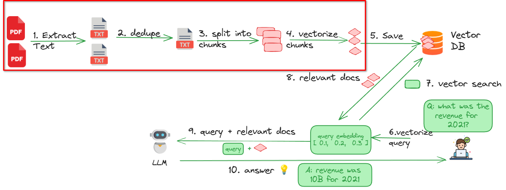
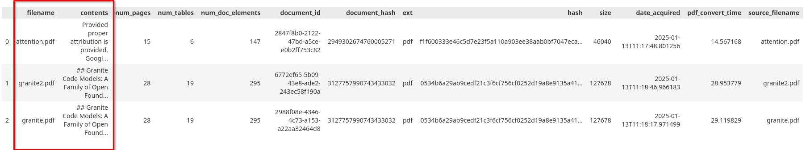
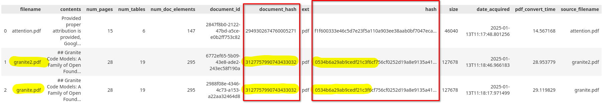
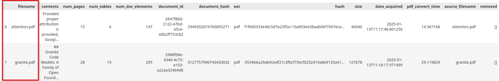
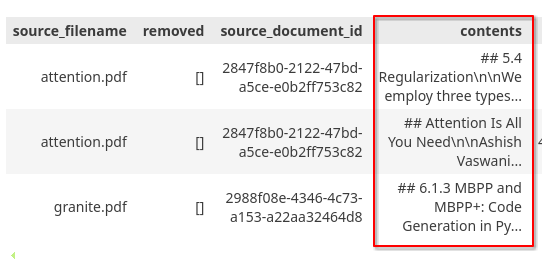
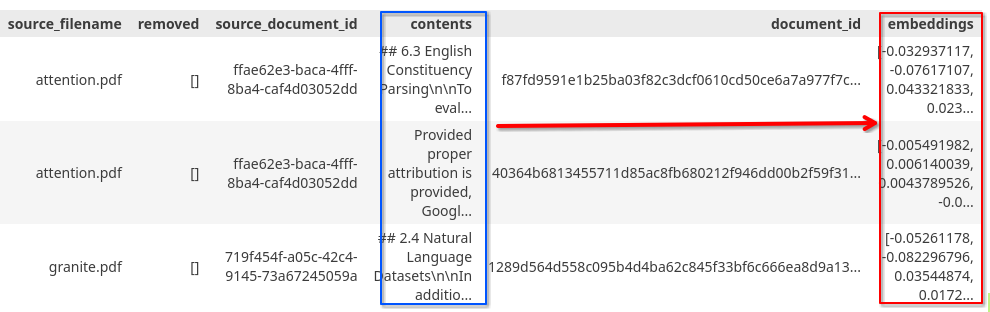
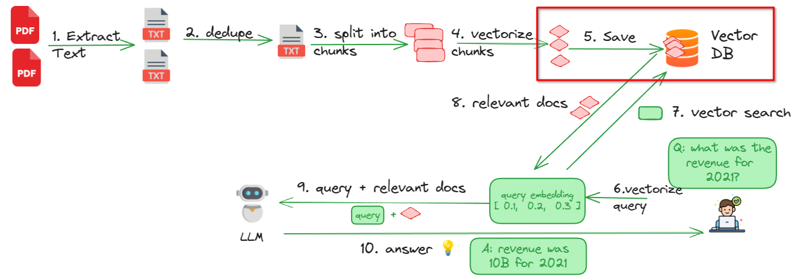
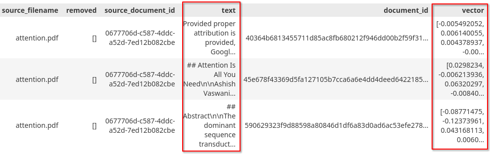
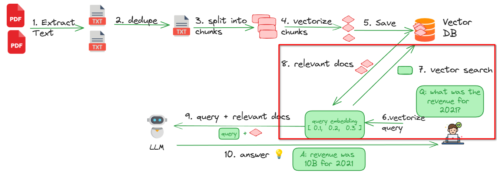
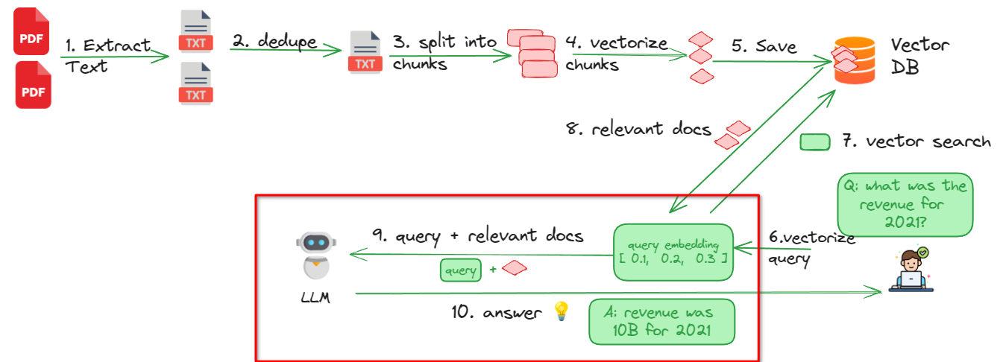

# Preparing PDFs for RAG Pipeline with Data Prep Kit

## Overview

Retrieval-augmented generation (RAG) enhances large language models (LLMs) by providing them with relevant, domain-specific information that they wouldn't otherwise know. LLMs are trained on vast amounts of public data but lack access to private or proprietary information. RAG solves this problem by retrieving relevant contextual information and feeding it to the model, thereby improving accuracy and reducing hallucinations.

RAG is widely used for question-answering systems, customer support automation, and knowledge-based AI applications. For an in-depth understanding, check out [What is Retrieval-Augmented Generation?](https://research.ibm.com/blog/retrieval-augmented-generation-RAG)

This tutorial will walk you through preparing PDF documents for a RAG pipeline and running queries on them effectively.

The following diagram illustrates the RAG pipeline workflow that you will implement in this tutorial.


## Prerequisites

To follow along, you’ll need:

- A local Python development environment.  While you can use an [Anaconda Python envronment](https://www.anaconda.com/download/), other tutorials in the Data Prep Kit learning path have used a Python virtual environment on Python v3.11.
- The [code](https://github.com/IBM/data-prep-kit/tree/dev/examples/notebooks/rag-pdf-1) for this tutorial.  Clone the Data Prep Kit repo locally, and you'll find the Jupyter Notebook in the `examples/notebooks/rag-pdf-1` directory.
- A (free) account at [Replicate](https://replicate.com/) to query LLMs. Use [this invite](https://replicate.com/invites/a8717bfe-2f3d-4a52-88ed-1356231cdf03) to add some credit to your Replicate account! The free account will give you a few API calls for free. That is enough for this tutorial.  Once you sign up, create a token by going to your account, selecting API tokens, and creating a new token, called rag-1 (you can use any name).

## Steps

The tutorial is structured into five steps (click on the links to jump to the section)

1. **[Getting Started](#step-1-getting-started)** – Set up your environment.
2. **[Processing PDFs](#step-2-processing-pdfs-using-data-prep-kit)** – Extract, clean, and chunk documents.
3. **[Saving Data in a Vector Database](#step-3-storing-data-in-a-vector-database)** – Store processed data efficiently.
4. **[Performing Vector Searches](#step-4-performing-vector-search)** – Retrieve relevant document chunks.
5. **[Querying Documents Using LLMs](#step-5-querying-documents-using-llms)** – Interact with your documents via an LLM.

---

## Step 1: Getting Started


### Step 1.1: Download the code

The code for RAG is [here](https://github.com/IBM/data-prep-kit/tree/dev/examples/notebooks/rag-pdf-1)

Start by cloning the repository

```bash
git    clone    https://github.com/IBM/data-prep-kit
```

The code for this tutorial is in this directory: `examples/notebooks/rag-pdf-1` .

All files referred in this tutorial are in this folder.

Go to the project directory

`cd   data-prep-kit/examples/notebooks/rag-pdf-1`


### Step 1.2: Setting up Python Dev Environment

You can install Anaconda by following the [guide here](https://www.anaconda.com/download/).

You can also use [mini conda](https://github.com/conda-forge/miniforge)

We will create an environment for this workshop with all the required libraries installed.

```bash
conda create -n data-prep-kit-rag -y python=3.11
```

activate the new conda environment

```bash
conda activate data-prep-kit-rag
```

**Note**: If you are on a linux system install these too

```bash
conda install gcc_linux-64

conda install gxx_linux-64
```

**Install dependencies**


Install requirements.txt from project directory: `examples/notebooks/rag-pdf`

```bash
pip  install  -r requirements.txt
```

**Start Jupyter**

`jupyter lab`

This will usually open a browser window/tab.  We will use this to run the notebooks

### Step 1.3: Sign up for Replicate

Get a **free** account at [replicate](https://replicate.com/home)

💰 Use this [invite](https://replicate.com/invites/a8717bfe-2f3d-4a52-88ed-1356231cdf03) to add some credit to your Replicate account!

The free account will give you a few API calls for free.  That is enough for this tutorial.

Once you sign up, **create a token** by following these steps.

- Go to **Account**
- And select **API tokens**
- Create a new token, called **rag-1** (you can use any name)


We are done with the setup.

---


## Step 2: Processing PDFs using Data Prep Kit

In this step, we will process PDF documents to prepare them for Retrieval Augmented Generation (RAG) queries. The steps involved are as follows:

1. Reading and extracting contents from PDFs
2. Removing duplicates
3. Splitting the extracted content into chunks
4. Creating embeddings for the chunks

You can find the code for this process in [rag_1_dpk_process_python.ipynb](../../examples/notebooks/rag-pdf-1/rag_1_dpk_process_python.ipynb)




### Step 2.1: Configuration

We have a common configuration parameters defined in [my_config.py](../../examples/notebooks/rag-pdf-1/my_config.py).  Below is a snippet:


```python

class MyConfig:
    pass 

MY_CONFIG = MyConfig ()

## Input Data - configure this to the folder we want to process
MY_CONFIG.INPUT_DATA_DIR = "input"
MY_CONFIG.OUTPUT_FOLDER = "output"
MY_CONFIG.OUTPUT_FOLDER_FINAL = os.path.join(MY_CONFIG.OUTPUT_FOLDER , "output_final")
### -------------------------------

### Milvus config
MY_CONFIG.DB_URI = './rag_1_dpk.db'  # For embedded instance
MY_CONFIG.COLLECTION_NAME = 'dpk_papers'


## Embedding model
MY_CONFIG.EMBEDDING_MODEL = 'ibm-granite/granite-embedding-30m-english'
MY_CONFIG.EMBEDDING_LENGTH = 384

## LLM Model
MY_CONFIG.LLM_MODEL = "ibm-granite/granite-3.0-8b-instruct"
MY_CONFIG.MAX_CONTEXT_WINDOW = 4096 #tokens
```

This configuration class centralizes all parameters, making it easy to add new ones:


```python
MY_CONFIG.SAMPLE_CONFIG = "hello"
```

In the main code, we initialize it as:

```python
from my_config import MY_CONFIG
```

### Best Practice Tip 💡

Having all our configuration parameters confined to one class keeps the global namespace clean.


### Step 2.2: Fetching PDFs

We download three PDF documents from [arxiv.org](https://arxiv.org), using the `download_file` function from [utils.py](../../examples/notebooks/rag-pdf-1/utils.py). The function checks for local existence before downloading.

```python
from utils import download_file

download_file (url = 'https://arxiv.org/pdf/1706.03762', local_file = os.path.join(MY_CONFIG.INPUT_DATA_DIR, 'attention.pdf' ))
download_file (url = 'https://arxiv.org/pdf/2405.04324', local_file = os.path.join(MY_CONFIG.INPUT_DATA_DIR, 'granite.pdf' ))
download_file (url = 'https://arxiv.org/pdf/2405.04324', local_file = os.path.join(MY_CONFIG.INPUT_DATA_DIR, 'granite2.pdf' )) # duplicate
```

**Why the duplicate?**  
We intentionally download the same file twice to demonstrate duplicate removal in a later step.


### Step 2.3: Setting Up Input and Output Directories

Processing follows a multi-stage approach:


`input ---(stage-1)--> output/01_stage1_out ---(stage 2)---> output/02_stage2_out` 

The output (`output/01_stage1_out`) becomes input to the next stage.  And so on.

The final processing pipeline:

`pdfs → (extract text) → 01_parquet_out → (dedupe) → 02_dedupe_out 
     → (chunking) → 03_chunk_out → (embeddings) → 04_embeddings_out → output_final`

Output folder structure:

```
output
├── 01_parquet_out
├── 02_dedupe_out
├── 03_chunk_out
├── 04_embeddings_out
└── output_final

```

### 📌 Why Parquet format?

The Data Prep Kit uses **Parquet** for intermediate data storage due to its efficiency:

✅ **Compressed storage** reduces disk usage.  
✅ **Faster queries** enable efficient data access.  
✅ **Scales well** for large datasets.

Learn more:  

* [Apache Parquet Official Site](https://parquet.apache.org/)
* [Databricks: What is Parquet?](https://www.databricks.com/glossary/what-is-parquet)

### Step 2.3: Extracting Contents from PDF (PDF2Parquet)

We use the `Pdf2Parquet` transformation to extract text from PDFs.

- Class: `dpk_pdf2parquet.transform_python.Pdf2Parquet`
- Found in  package : `data-prep-toolkit-transforms[pdf2parquet]` (installed as part of `data-prep-toolkit-transforms[all]`)

[PDF2Parquet documentation](https://github.com/IBM/data-prep-kit/tree/dev/transforms/language/pdf2parquet)

Here is the code that does it (abbreviated):

```python
from dpk_pdf2parquet.transform_python import Pdf2Parquet
from dpk_pdf2parquet.transform import pdf2parquet_contents_types

result = Pdf2Parquet(input_folder= 'input',
                    output_folder= 'output/01_parquet_out',
                    data_files_to_use=['.pdf'],
                    pdf2parquet_contents_type=pdf2parquet_contents_types.MARKDOWN,   # markdown
                    ).transform()

if result != 0:
    raise Exception ('process failed')
```

Parameters explained:
- **`input_folder`** : where to read data files from
- **`output_folder`** : destination for output folder
- **`data_files_to_use`** : specify file filters; here we are only intereseted in PDF files
- **`pdf2parquet_contents_type`** : This controls the output format for extracted content.  It can be JSON or markdown.
    - for markdown: `pdf2parquet_contents_type=pdf2parquet_contents_types.MARKDOWN`
    - for JSON: `pdf2parquet_contents_type=pdf2parquet_contents_types.JSON'`

### Step 2.4: Understanding the Output

Each input PDF generates a corresponding Parquet file in `output/01_parquet_out`.

```
├── 01_parquet_out
│   ├── attention.parquet
│   ├── granite2.parquet
│   ├── granite.parquet
│   └── metadata.json
```


Let's inspect the output using `read_parquet_files_as_df`  - a utility function from [utils.py](../../examples/notebooks/rag-pdf-1/utils.py)

```python
from utils import read_parquet_files_as_df

output_df = read_parquet_files_as_df('01_parquet_out')
output_df.head(5)
```


Output explained:

- we will have one entry per input file (so 3 total)
- **`filename`** column is the name of input file. 
- **`contents`** column has the markdown text extracted from PDFs
- **`num_pages`**, **`num_tables`** columns indicate detected metadata
- **`document_id`** is a unique id generated for each document
- **`document_hash`** is a hash calcuated on entire file
- **`hash`** is calculated from **contents** column.  Note this is different from `document_hash`
- **`pdf_convert_time`** denotes the time took to process each pdf in seconds

### Step 2.5: Eliminating Duplicate Documents

We have 2 identical copies of `granite.pdf`.  Also observe the `hash` values for these documents are the same.  We are going to eliminate one of the duplicates.



Removing duplicates has benefits such as

- reducing the amount of data we have to process down the pipeline
- improving the quality of RAG results

### Step 2.6: Removing Duplicates

We will use **Exect Deduplicate transform (Ededupe)** for this.  Ededupe compute the hash values on `contents` of each file.  Files with duplicate hashes are filtered out.

- Class : `dpk_ededup.transform_python.Ededup`
- Found in  package : `data-prep-toolkit-transforms[ededup]` (installed as part of `data-prep-toolkit-transforms[all]`)

[Exact dedeupe filter documentation](https://github.com/IBM/data-prep-kit/blob/dev/transforms/universal/ededup/README.md)

```python
from dpk_ededup.transform_python import Ededup

result = Ededup(input_folder='01_parquet_out',
                output_folder='output/02_dedupe_out',
                ededup_doc_column="contents",
                ededup_doc_id_column="document_id"
                ).transform()

if result != 0:
    raise Exception ('process failed')
```

Parameters explained:

- **`input_folder`**: we are reading the output created by previous step (pdf2parquet)
- **`output_folder`**: filtered files will be in 'output/02_dedupe_out'
- **`ededup_doc_column = 'contents'`**: This is the column we will calculate hash values for
- **`ededup_doc_id_column = 'document_id'`**: column to store the computed hash above

### Step 2.7: Understanding the Output

```python
from utils import read_parquet_files_as_df

output_df = read_parquet_files_as_df('output/02_dedupe_out')
output_df.head(5)
```

After deduplication, one of the duplicate `granite.pdf` files is removed.




###  Step 2.8: Splitting Documents into Chunks

We split documents into smaller **retrieval-friendly** chunks using **`DocChunk`** transformation.

- Class : `dpk_doc_chunk.transform_python.DocChunk`
- Found in  package : `data-prep-toolkit-transforms[doc_chunk]` (installed as part of `data-prep-toolkit-transforms[all]`)

[Chunking transform documentation](https://github.com/IBM/data-prep-kit/blob/dev/transforms/language/doc_chunk/README.md)

```python
from dpk_doc_chunk.transform_python import DocChunk

result = DocChunk(input_folder='output/02_dedupe_out',
                    output_folder='output/03_chunk_out',
                    doc_chunk_chunking_type= "li_markdown",
                    # doc_chunk_chunking_type= "dl_json",
                    doc_chunk_chunk_size_tokens = 128,  # default 128
                    doc_chunk_chunk_overlap_tokens=30   # default 30
                    ).transform()
```

Parameters explained:

- **`input_folder`** and `output_folder` are self explanatory
- **`doc_chunk_chunking_type = "li_markdown"`** as we are parsing markdown text.  Here we will be using Llama-Index markdown parser.  If we want to split json text into chunks set this to `"dl_json"`
- **`doc_chunk_chunk_size_tokens = 128`** : Size of each chunk is about 128 tokens (approx 100 words).  Default value for this is 128
- **`doc_chunk_chunk_overlap_tokens=30`** : overlap between chunks is about 30 tokens (~25 words).   Default value for this is 30.

### 📌 Chunking Strategy

We are using  **chunking size = 128 tokens (~100 words)** and **Overlap: 30 tokens (~25 words)**  

**Experiment with chunking settings to find one that works best for your documents**

🔗 **Further reading on chunking:**  

- [A Guide to Chunking Strategies for Retrieval Augmented Generation (RAG)](https://zilliz.com/learn/guide-to-chunking-strategies-for-rag)
- [Understanding Chunking Strategies](https://www.sagacify.com/news/a-guide-to-chunking-strategies-for-retrieval-augmented-generation-rag)

### Step 2.9: Understanding chunking output

```python
from utils import read_parquet_files_as_df

input_df = read_parquet_files_as_df('output/02_dedupe_out')
output_df = read_parquet_files_as_df('output/03_chunk_out')

print (f"Files processed : {input_df.shape[0]:,}")
print (f"Chunks created : {output_df.shape[0]:,}")

output_df.sample(min(3, output_df.shape[0]))
```

Output 

```text
Files processed : 2
Chunks created : 60
```

The 2 PDF files have been split into 60 chunks.

Here is a sample output of few chunks




### Step 2.10: Create Embeddings for Chunks

The final step in our processing pipeline is to **generate embeddings for the extracted chunks**.  

### 📌 Why embeddings?


**Embeddings** play a crucial role in the RAG process, enabling fast search and retrieval of complex data like text and images.  

📖 **Further Reading**: [Embeddings Explained](embeddings-explained.md)


We generate embeddings for each chunk using `TextEncoder`.

- Class : `dpk_text_encoder.transform_python.TextEncoder`
- Found in  package : `data-prep-toolkit-transforms[text_encoder]` (installed as part of `data-prep-toolkit-transforms[all]`)

[Embeddings / Text Encoder documentation](https://github.com/IBM/data-prep-kit/blob/dev/transforms/language/text_encoder/README.md)


Here is the code (abbreviated) to transform **chunks --> embeddings**


```python
from dpk_text_encoder.transform_python import TextEncoder

result = TextEncoder(input_folder= 'output/03_chunk_out', 
                    output_folder= 'output/04_embeddings_out', 
                    text_encoder_model_name = 'ibm-granite/granite-embedding-30m-english'
                    ).transform()
```

Parameters:

- **`input_folder` and `output_folder`** are respectively for reading and writing 
- **`text_encoder_model_name = 'ibm-granite/granite-embedding-30m-english'`** - Here we can specify any open source embedding model.  There are numerous embedding models we can use.  We are using **ibm-granite/granite-embedding-30m-english** as it is a small model (hence quick to run) and gives decent results. [Hugging Face's embedding model leaderboard](https://huggingface.co/spaces/mteb/leaderboard) is an excellent resource for finding suitable embedding models.

### Step 2.11: Understanding embedding output

```python
from utils import read_parquet_files_as_df

output_df = read_parquet_files_as_df('output/04_embeddings_out')
output_df.sample(3)
```

In the produced output we see a new column called **embeddings**.  This column has embeddings computed for text **contents** column - these chunked texts



### Step 2: Conclusion

In this step, we accomplished the following: 

✅ **Extracted text** from PDFs → Store in Parquet.  
✅ **Deduplicated** documents → Remove redundant files.  
✅ **Chunked documents** → Optimize for retrieval.  
✅ **Generated embeddings** → Prepare for vector search.

---

## Step 3: Storing Data in a Vector Database

Now that we've processed our PDF data, the next step is to store it in a **vector database** for efficient retrieval. In this guide, we'll be using **Milvus**, a powerful open-source vector database designed for handling unstructured data like text embeddings. 

💻 **Code Reference**: [rag_2_load_data_into_milvus.ipynb](../../examples/notebooks/rag-pdf-1/rag_2_load_data_into_milvus.ipynb)





###  Why Milvus?

Milvus is built for high-performance **vector similarity search** and is optimized for working with embeddings generated from text, images, and audio. It allows for fast and scalable querying, making it ideal for **retrieval-augmented generation (RAG) workflows** like ours.  

🔗 Learn more about Milvus: [milvus.io](https://milvus.io/)


### Step 3.1: Load Configuration

Before we begin, let’s import our configuration settings:  


```python
from my_config import MY_CONFIG
```

### Step 3.2: Load Processed PDF data

We'll now load the data we saved in the previous step (**pdf2parquet**) from the `output/output_final` directory. This folder contains **Parquet** files—one for each input PDF. 

The following code does the following:

- Reads all Parquet files using `pandas.read_parquet`  
-  Combines them into a single DataFrame using `pandas.concat`  

```python
import pandas as pd
import glob

# Get a list of all Parquet files in the directory
parquet_files = glob.glob(f'{MY_CONFIG.OUTPUT_FOLDER_FINAL}/*.parquet')

# Create an empty list to store the DataFrames
dfs = []

# Loop through each Parquet file and read it into a DataFrame
for file in parquet_files:
    df = pd.read_parquet(file)
    dfs.append(df)

# Concatenate all DataFrames into a single DataFrame
data_df = pd.concat(dfs, ignore_index=True)
```

We are also renaming the  columns as follows, to match Milvus’ expected format.

- `embeddings` --> `vector`
- `contents` --> `text`

```python
data_df = data_df.rename( columns= {'embeddings' : 'vector', 'contents' : 'text'})
```

**After this step, our processed data looks like this:** 




### Step 3.3: Connect to Milvus

We’re connecting to an **embedded Milvus instance** (a local database file `rag_1_dpk.db`). While this works for testing, in production, you’d connect to a cloud-hosted instance.  

```python
from pymilvus import MilvusClient

milvus_client = MilvusClient(MY_CONFIG.DB_URI)
```


### Step 3.4: Create a Milvus Collection

Before inserting data, we **clear any existing collection** to ensure a fresh import.  

Then we are creating a collection with these properties:

- **`collection_name = 'dpk_papers'`** → name of our collection
- **`dimension=384`**: → Matches the output length of our embedding model  
- **`metric_type='IP'`** → Uses **Inner Product Distance** for similarity search
- **`consistency_level='Strong'`** → Ensures consistent query results.  For more details, check [Milvus documentation](https://milvus.io/docs/consistency.md)
- **`auto_id=True`** → Milvus assigns primary IDs automatically  

🔗 **More on Milvus collections**: [Milvus Docs](https://milvus.io/docs/create-collection.md) 


**Code: Creating the Collection**  

```python
# if we already have a collection, clear it first
if milvus_client.has_collection(collection_name='dpk_papers'):
    milvus_client.drop_collection(collection_name='dpk_papers')


milvus_client.create_collection(
    collection_name='dpk_papers',
    dimension=384,
    metric_type="IP",  # Inner product distance
    consistency_level="Strong",  # Strong consistency level
    auto_id=True
)
```


### Step 3.5: Insert Data into Milvus

Now that our collection is set up, let’s **insert our processed data** into Milvus.  

```python
res = milvus_client.insert(collection_name='dpk_papers', 
                            data=data_df.to_dict('records'))

print('inserted # rows', res['insert_count'])
milvus_client.get_collection_stats('dpk_papers')
```

**Example Output:**  

```text
inserted # rows 60
```


### Step 3.6: Close the Connection

Once the data is successfully stored, we **close the Milvus connection** to free up resources.  

```python
milvus_client.close()
```

---

## Step 4: Performing Vector Search

Now that we’ve successfully imported our data and embeddings into the **Milvus vector database**, it’s time to run some powerful queries!

Unlike traditional **keyword searches**, these queries perform **semantic searches**, meaning they retrieve results based on meaning rather than exact word matches.


💻 **Code Reference**: [rag_3_vector_search.ipynb](../../examples/notebooks/rag-pdf-1/rag_3_vector_search.ipynb)





### Step 4.1: Load Configuration

First, let’s load our configuration settings:


```python
from my_config import MY_CONFIG
```

### Step 4.2: Connect to Vector Database

We’ll be connecting to an **embedded Milvus instance**, which is a local database file (`rag_1_dpk.db`). While this setup is great for testing, a production environment would typically connect to a cloud-hosted Milvus instance.

```python
from pymilvus import MilvusClient

milvus_client = MilvusClient(MY_CONFIG.DB_URI)
```


### Step 4.3: Setup Embeddings

Before we can search, we need to convert our query strings into vector embeddings using the same embedding model we used earlier.

Here is the code:


```python
import os
os.environ['HF_ENDPOINT'] = 'https://hf-mirror.com'

from sentence_transformers import SentenceTransformer

embedding_model = SentenceTransformer(MY_CONFIG.EMBEDDING_MODEL)

def get_embeddings (str):
    embeddings = embedding_model.encode(str, normalize_embeddings=True)
    return embeddings
```

**Code Breakdown:**

- We set the **`HF_ENDPOINT`** to Hugging Face’s mirror to ensure smooth model downloads.
- The **`get_embeddings`** function converts a text query into an embedding vector.

**Testing the Embedding Conversion:**


```python
# Test Embeddings
text = 'Paris 2024 Olympics'
embeddings = get_embeddings(text)
print ('sentence transformer : embeddings len =', len(embeddings))
print ('sentence transformer : embeddings[:5] = ', embeddings[:5])
```

**Sample Output:**

```text
sentence transformer : embeddings len = 384
sentence transformer : embeddings[:5] =  [ 0.02468892  0.10352131  0.0275264  -0.08551715 -0.01412829]
```

### Step 4.4: Search Helper functions

To streamline our search, we define a helper function:

```python
def  do_vector_search (query):
    query_vectors = [get_embeddings(query)] 

    results = milvus_client.search(
        collection_name=MY_CONFIG.COLLECTION_NAME,  # target collection
        data=query_vectors,  # query vectors
        limit=5,  # number of returned entities
        output_fields=["filename", "page_number", "text"],  
        # specifies fields to be returned
    )
    return results
## ----
```

**Code Breakdown:**

- Converts the query text into an embedding vector.
- Executes a **vector search** in the Milvus database.
- Returns the **top 5** most relevant results.

### Step 4.5: Running a Search Query

Now, let’s test it out!

```python
query = "What was the training data used to train Granite models?"

results = do_vector_search (query)
print_search_results(results)
```

This will output the top matches, ranked by **search score** (higher scores indicate better matches, with a range of **0 to 1.0**).

**Sample Output:**


```text
num results :  5
------ result 1 --------
search score: 0.5530709028244019
filename: granite.pdf
text: ...


 ------ result 2 --------
search score: 0.477556437253952
filename: granite.pdf
text: ...

...
```

From this output, we can see that the search has successfully retrieved relevant results, with the top match scoring **0.553**.


---

## Step 5: Querying Documents Using LLMs

Welcome to the final step of our RAG (Retrieval-Augmented Generation) pipeline! Here, we’ll explore how to query documents effectively using a Large Language Model (LLM).

💻 **Code Reference**: [rag_4_query_replicate.ipynb](../../examples/notebooks/rag-pdf-1/rag_4_query_replicate.ipynb)





### Step 5.1: Load Configuration

First, let’s load our configuration settings:


```python
from my_config import MY_CONFIG
```


### Step 5.2: Load settings from `.env` file

We need to load the **`REPLICATE_API_TOKEN`** from our `.env` file to authenticate API calls to the **Replicate** service.

Code:

```python
from dotenv import find_dotenv, dotenv_values

config = dotenv_values(find_dotenv())

MY_CONFIG.REPLICATE_API_TOKEN = config.get('REPLICATE_API_TOKEN')
```

### 💡 **Why Use `.env` Files?**

`.env` files store sensitive configurations such as database passwords and API keys. These files should remain private and should not be checked into the codebase.


### Step 5.3: Connect to Vector Database

We'll establish a connection to an **embedded Milvus instance**, which stores our document embeddings. For production environments, a cloud-hosted Milvus instance is recommended.

```python
from pymilvus import MilvusClient

milvus_client = MilvusClient(MY_CONFIG.DB_URI)
```


### Step 5.4: Setup Embeddings

An embedding model converts text into vector representations for efficient searching.


```python
import os
os.environ['HF_ENDPOINT'] = 'https://hf-mirror.com'

from sentence_transformers import SentenceTransformer

embedding_model = SentenceTransformer(MY_CONFIG.EMBEDDING_MODEL)

def get_embeddings (str):
    embeddings = embedding_model.encode(str, normalize_embeddings=True)
    return embeddings
```

**Code Breakdown:**

- We set the **`HF_ENDPOINT`** to Hugging Face’s mirror to ensure smooth model downloads.
- The **`get_embeddings`** function converts a text query into an embedding vector.


### Step 5.5: Vector search handy functions

Before querying the LLM, we need to retrieve relevant documents using vector search..

```python
def fetch_relevant_documents (query : str) :
    search_res = milvus_client.search(
        collection_name=MY_CONFIG.COLLECTION_NAME,
        data = [get_embeddings(query)], 
        limit=3,  # Return top 3 results
        search_params={"metric_type": "IP", "params": {}},  # Inner product distance
        output_fields=["text"],  # Return the text field
    )
    retrieved_docs_with_distances = [
        {'text': res["entity"]["text"], 'distance' : res["distance"]} for res in search_res[0]
    ]
    return retrieved_docs_with_distances
```

**Code breakdown**

- **`milvus_client.search`** performs a **semantic search** using **Inner Product (IP) distance**.
- Retrieves **top 3** most relevant documents.


### Step 5.6: Initialize LLM

We will use **[replicate](https://replicate.com/)** service to run LLMs.  Replicate allows calling LLMs using easy to use APIs.

**Choosing an LLM**

We’ll use an open-source model from the available options.

We will proceed with **`ibm-granite/granite-3.0-8b-instruct`**.


| Model                               | Publisher | Params | Description                                          |
|-------------------------------------|-----------|--------|------------------------------------------------------|
| ibm-granite/granite-3.0-8b-instruct | IBM       | 8 B    | IBM's newest Granite Model v3.0  (default)           |
| ibm-granite/granite-3.0-2b-instruct | IBM       | 2 B    | IBM's newest Granite Model v3.0                      |
| meta/meta-llama-3.1-405b-instruct   | Meta      | 405 B  | Meta's flagship 405 billion parameter language model |
| meta/meta-llama-3-8b-instruct       | Meta      | 8 B    | Meta's 8 billion parameter language model            |
| meta/meta-llama-3-70b-instruct      | Meta      | 70 B   | Meta's 70 billion parameter language model           |


**LLM query function**

The **`ask__LLM`** function prepares the query for LLM

Here is abbreviated code

```python
def ask_LLM (question, relevant_docs):
    context = "\n".join(
        [doc['text'] for doc in relevant_docs]
    )

    system_prompt = """
    You are an AI assistant. You are able to find answers to the questions from the contextual passage snippets provided.
    """

    user_prompt = f"""
    Use the following pieces of information enclosed in <context> tags to provide an answer to the question enclosed in <question> tags.
    <context>
    {context}
    </context>
    <question>
    {question}
    </question>
    """
    ...
    # parameters to the LLM
    params = {
            "top_k": 1,
            "top_p": 0.95,
            "temperature": 0.1,
            "prompt": user_prompt,
            "system_prompt": system_prompt,

            ...
    }
```

**Code explained**

**system prompt** guides the models behavior and directing it to generate responses **only** from the provided context.

**User Prompt**: Supplies the **retrieved documents** alongside the user’s question.

**Key Parameters**:
- **top_k=1** - pick the first result from possible results
- **temperature** controls the 'randomness' or 'creativity' of a model.Higher temperatures makes the model more 'creative'.  Smaller values makes the model more deterministic and focused, providing concise and precise answers.

### Step 5.7: Query LLM

```python
question = "What was the training data used to train Granite models?"
relevant_docs = fetch_relevant_documents(question)
ask_LLM(question=question, relevant_docs=relevant_docs)
```

**Expected Output:**

```text
The Granite Code Instruct models were trained on a combination of permissively licensed data, including the Code Commits Dataset (CommitPackFT) and Math Datasets (MathInstruct and MetaMathQA). Additionally, they were trained on Code Instruction Datasets such as Glaive-Code-Assistant-v3, Self-OSS-Instruct-SC2, Glaive-Function-Calling-v2, and NL2SQL.
```

✅ The model provides a precise response based on the available documents.

**Testing Model Constraints**

Let’s test if our model adheres to instructions when asked about something **outside our dataset**:


```python
question = "When was the moon landing?"
relevant_docs = fetch_relevant_documents(question)
ask_LLM(question=question, relevant_docs=relevant_docs)
```

**Expected Output:**

```text
I'm sorry, the provided context does not contain information about the moon landing.
```

✅ Success! The model correctly limits responses to retrieved documents.

---


## Summary

By completing this tutorial, you’ve learned how to:
- Process and prepare PDFs for a RAG pipeline.
- Store data in a vector database.
- Perform vector searches.
- Query documents using an LLM.

This workflow is a foundation for building AI-powered applications that integrate private knowledge into LLMs efficiently. 

**Happy coding!**

