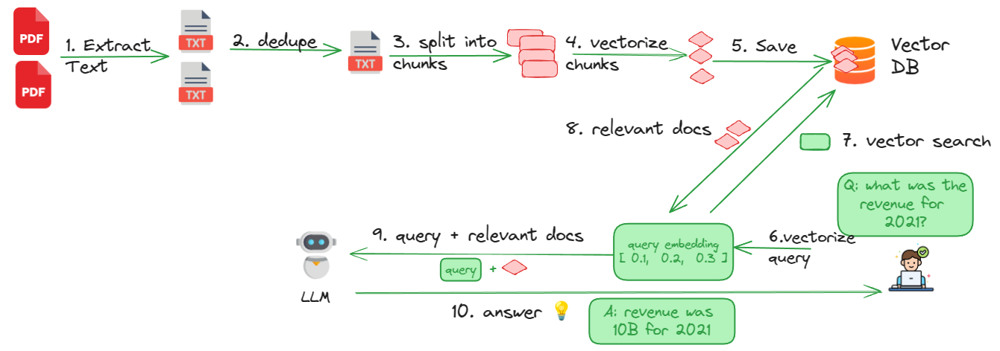

# Preparing PDFs for RAG Pipeline with Data Prep Kit

This tutorial will cover how to prepare PDF documents for RAG and performing RAG queries on the documents.

## What You Will Learn

- Understanding RAG process
- Processing PDFs (Extracting text from PDFs, removing duplicate content, chunking documents and creating embeddings)
- Saving data into a vector database 
- Performing vector search on documents
- Query the documents with LLMs

## What You Will Need

To complete this tutorial, you will need:

- A local python development environment
- A (free) account at Replicate - for querying LLMs

## Skill Level

Intermediate

## Estimated Time 

Approximately one hour

## Audience

Python devlopers, LLM application developers, Data Scientists, ML Engineers

## RAG Explained

Large Language Models (LLMs) are very powerful.  They are trained on a lot of data - most of it publicly available.  The models do not know our private data.

So how can be leverage their knowledge to answer questions about our private data?

RAG  (Retrieval-Augmented Generation) addresses this by extracting relevant context and and providing answers.

RAG addresses the limitations of standalone generative models by grounding their outputs in factual data, reducing hallucinations, and enabling dynamic incorporation of up-to-date or domain-specific knowledge

RAG is widely used in applications like question answering, customer support, and knowledge-based systems.

These are good references to RAG:

- [What is retrieval-augmented generation?](https://research.ibm.com/blog/retrieval-augmented-generation-RAG)

## Overview

Here is the overall workflow

This tutorial consistss of the following sections:

- [1 - Getting started](#step-1-getting-started)
- [2 - Processing PDFs](#step-2-processing-pdfs-using-data-prep-kit)
- Creating embeddings

See below for detailed descriptions for each sections and corresponding code.

## Step-1: Getting Started

Follow this guide to get the code and get your environment setup.

[Guide](1-getting-started.md)

## Step-2: Processing PDFs Using Data Prep Kit

Here we will do the following

- Extract content from PDF files
- Perform de-duplication of documents
- Split the documents as chunks
- Vectorize the chunks

[Guide](2-processing-pdfs.md)  | [code](../../examples/notebooks/rag-pdf-1/rag_2_load_data_into_milvus.ipynb)

## Step-3: Save data into a Vector Database

We will load the processed PDF data into a vector database

[Guide](3-load-data-into-vector-db.md)  | [code](../../examples/notebooks/rag-pdf-1/rag_2_load_data_into_milvus.ipynb)

## Step-4: Perform Vector Search

Perform vector search on our documents.

[Guide](4-vector-search.md)  | [code](../../examples/notebooks/rag-pdf-1/rag_3_vector_search.ipynb)

## Step-5: Query the Documents Using LLM