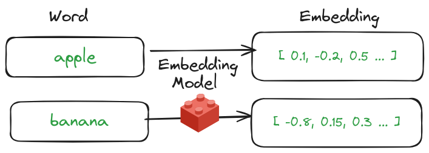
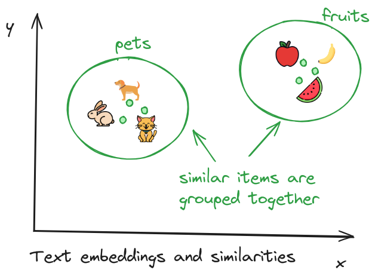
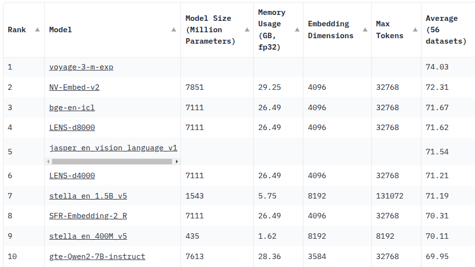

# Understanding Embeddings

**Embeddings** are basically numerical representation (called **vectors**) of complex data like text / audio / video.  Embeddings allow computers to process complex data more efficiently.

Let's take text as an example: Each word is converted into a number, with unique words having distinct numerical values. These numbers can range from 128 to 4096 elements.

What makes embeddings special is their ability to capture more than just random sequences of numbers. They actually preserve some of the meaning from the original data. For instance, words with similar meanings tend to have embeddings that are close together in numerical space.

To understand this better, imagine plotting the embeddings of several words on a two-dimensional graph for easier visualization. While real-world embeddings can span many dimensions (from 128 to 4096), this example helps explain the concept. On the graph, you'll see that items with similar meanings or contexts—like different types of fruits or various pets—are positioned closer together. This clustering is a key strength of embeddings, showing their ability to capture and reflect subtle differences in meaning and similarity within the data.

## Embedding Models

**An Embedding Model** is used to transform text into numerical representations called embeddings. There are many embedding models available, ranging from proprietary ones owned by specific companies to open-source models that can be freely downloaded and used on your own computer.

Proprietary models, such as those provided by OpenAI, are often accessed through APIs and are typically owned by large tech companies. On the other hand, open-source models allow you to download and use them independently on your system.

[Hugging Face's embedding model leaderboard](https://huggingface.co/spaces/mteb/leaderboard) is an excellent resource for finding suitable embedding models. This platform regularly tests and ranks available models based on various criteria, helping you choose the best option for your needs.

By exploring this leaderboard, you can discover which models perform well across different tasks and datasets, making it easier to select one that fits your specific requirements.

Here is a snapshot of open embedding models from Hugging Face's embedding leaderboard as of January 2025.

References:

- [The Beginner’s Guide to Text Embeddings](https://www.deepset.ai/blog/the-beginners-guide-to-text-embeddings)
- [Getting Started With Embeddings](https://huggingface.co/blog/getting-started-with-embeddings)
